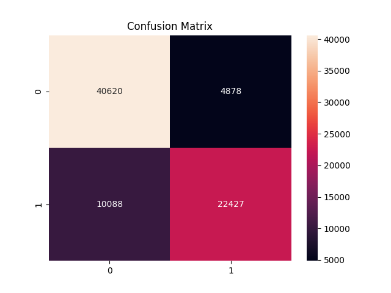

<<<<<<< HEAD
# Flight Delay Classification

##  Objective
To predict whether a flight will be delayed or not using machine learning.

##  Dataset
Flight dataset containing features like:
- Airline
- Distance
- Departure Delay
- Day of Week
- Scheduled Departure

##  Steps Performed
- Data Cleaning (removed cancelled flights, handled missing values)
- Exploratory Data Analysis (EDA)
- Feature Engineering (weekend, delay bins, ratios)
- Encoding (One-hot encoding)
- Scaling (StandardScaler)
- Model Training (XGBoost Classifier)

##  Results
- Accuracy: ~80%

##  Output


##  How to Run

```bash
python src/analysis_preprocess.py
python src/train.py
=======
# flights_delay_classification
Machine Learning project to predict whether a flight will be delayed using XGBoost. Includes data preprocessing, feature engineering, and model evaluation.
>>>>>>> 6714c5d8a43dd96501c75eb54fe8815754daecdd
